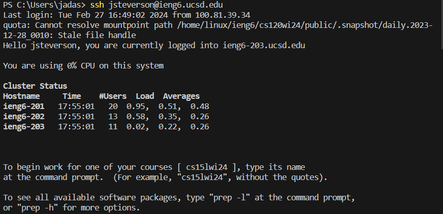
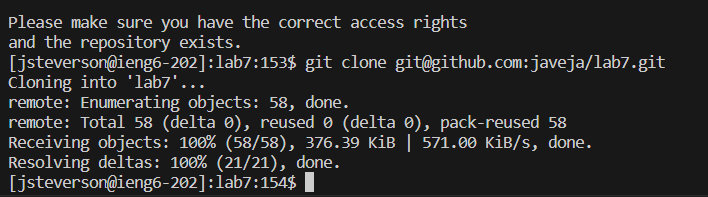
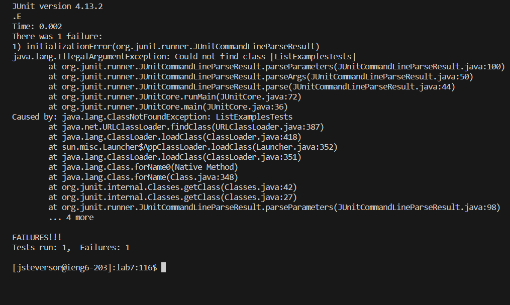
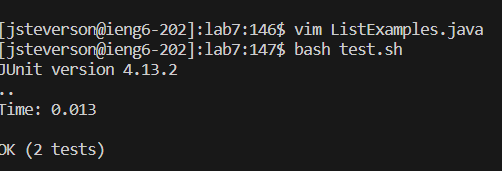
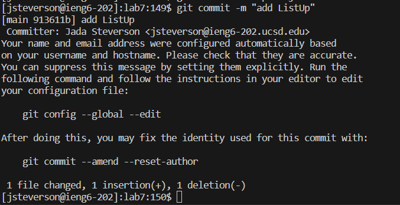

# Lab Report 4
## Part 1 - Log into my server.

## Keys Pressed: ssh, `<space>`, jsteverson@ieng6-202.ucsd.edu, `<enter>`

## Ssh and using the user name jsteverson... makes me logged into my server to get access to all my personal files.

## Part 2 - clone git.

## Keys Pressed: git, `<space>`, clone, Ctr V (git link from git hub), `<enter>`

## Git is getting a files from github and gives me access to the code and copies it over so I can have personal access to edit it.

## Part 3 - run the failing test.

## Keys Pressed: bash, `<space>`, test.sh, `<enter>`

## Bash is used to run the test file `test.sh` and outputs the error of one test failing.

## Part 4 - edit and fix the failing code.

## Keys Pressed: vim, `<space>`, TestExample.java, `<enter>`, `<up>`, `<up>`, `<up>`, `<up>`, `<up>`, `<up>`, `<right>`, `<right>`, `<right>`, `<right>`, `<right>`, `<right>`, `<right>`, `<right>`, `<right>`, `<right>`, i, `<backspace>`, 2, `<esc>`, :wq, `<enter>`

## This enters vim mode which is a mode that allows editing directly in the terminal, I move the cursor up and over manually, then presses i to go into insert mode, which allows editing, to delete the 1 and replace it with a 2 to fix the code. Then leave insert mode with `esc` and use `:wq` to save and exit vim.

## Part 5 - rerun the fixed code.

## Keys Pressed: `<up>`, `<up>`, `<enter>`

## By prsssing up in the terminal it retrieves the previous `bash test.sh` code from earlier and runs by pressing enter again to see if the test passes.

## Part 6 - commit and push 

## Keys Pressed: git, `<space>`, add, `<space>`, ListExamples.java, `<enter>`, git, `<space>`, commit, `<space>`, -m, `<space>`, "addListUp", `<enter>`

## Using git add and commit makes the file we edited in vim save the changes to the git file in github.

