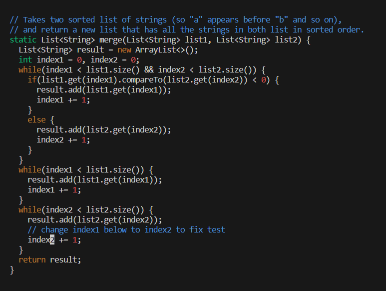

# Lab Report 4
## Part 1 - Log in

Keys Pressed: ssh, <space>, jsteverson@ieng6-202.ucsd.edu, <enter>
In doing this I logged into my server to get access to all my personal files.

## Part 2 - clone git

Keys Pressed: git, <space>, clone, Ctr V (git link from git hub), <enter>
This gives me access to the code and copies it over so I can have personal access to it edit it.

## Part 3 - run the failing test

Keys Pressed: bash, <space>, test.sh, <enter>
This runs the tester files and outputs the error of one test failing.

## Part 4 - edit the failing code

