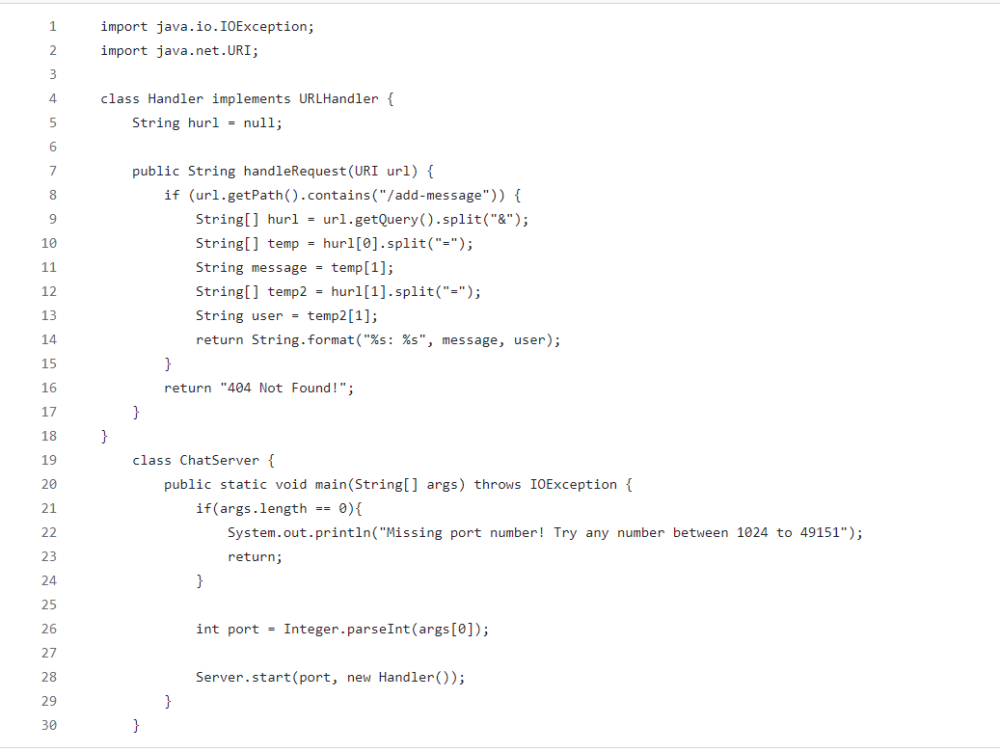

# PART 1

## Image 1

The methods used are `url.getPath()`, `.contains()`, `.split()`, and `format()`. The argruments were the parts of the url that I needed to get and return out. I used a few String arrays called message, temp, and user to extract the text from the url.

## Image 2

The methods used are `url.getPath()`, `.contains()`, `.split()`, and `format()`. The argruments were the parts of the url that I needed to get and return out. I used a few String arrays called message, temp, and user to extract the text from the url.

# PART 2

## Private

## Public
	

## No Password
	

# PART 3

I learned how to open up a server on a different computer from my own. It is really intresting seeing all my files and folders accessed in the code. It makes me understand the structure and complexities of computers as a whole.

