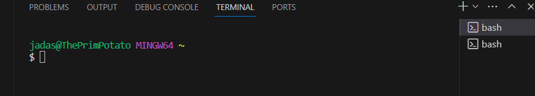

# PART 1

I was not able to implement the url. It would not work when I ran it.
	

# PART 2

## Private

## Public
	

## No Password
	

# PART 3

I learned how to open up a server on a different computer from my own. It is really intresting seeing all my files and folders accessed in the code. It makes me understand the structure and complexities of computers as a whole.

