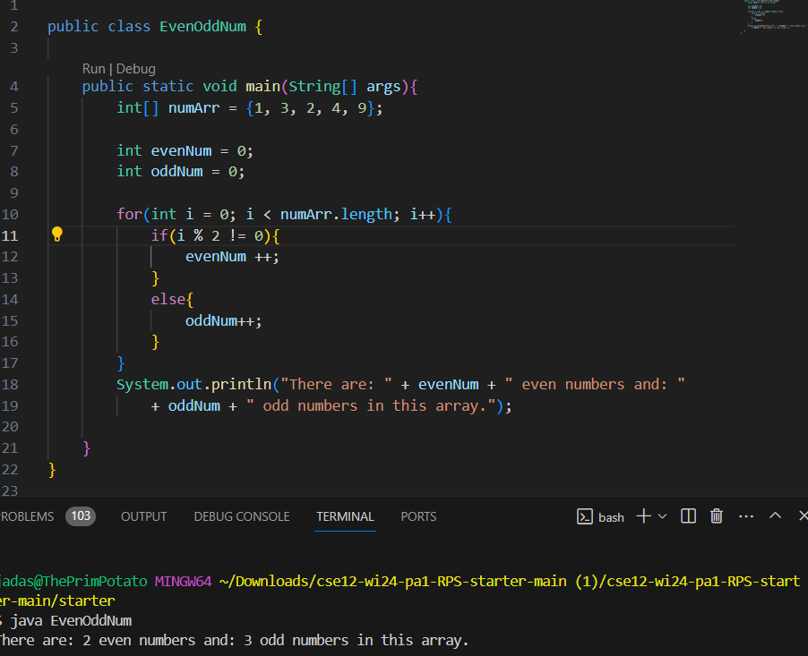
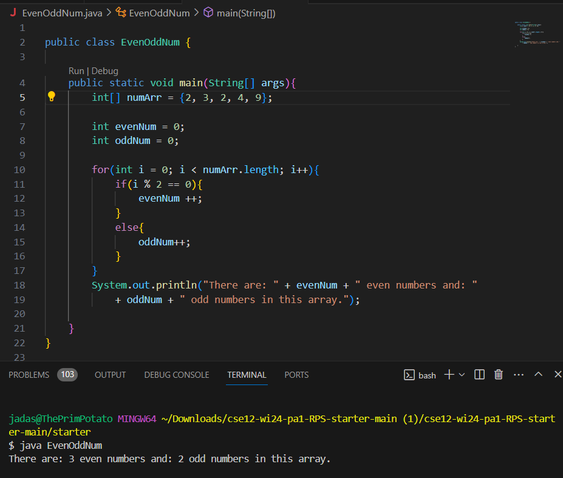

# Part 1
## Student Post: Dear Tutor my name is Jamie and I have an error with my code. I am trying to create a code where I count the anount of even and odd numbers in a list. I used a for loop and I ran my code but it swiches the odd number and even numbers. I dont know what I need to do to fix this error. I sent you the code here can you help?

## TA Answer: Hello Jamie, this is a really cool peice of code. Have you tried checking your if statements and seeing if they work?
## Student Fixed Code: Dear Tutor thank you so much that worked perfectly!

## The files had a code that ran but was checking for the odd numbers because the code had a != istead of a ==. The student ran javac EvenOddNum.java then java EvenOddNum. To fix the bug you have to change the not equals to be ==.

## One thing from this class that I learned was how to use vim. Vim is a en editer for code. You can use it in the terminal to edit and change code then to show thoes edits in the oringinal files. I find Vim to be very useful and fun. It was not a har concept for me to grasp like other parts of this class so that also added to how much I like it. IT is also really useful if you don't want to have to go all the way to the code to edit anything. It't all just right there for you.
