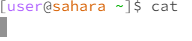
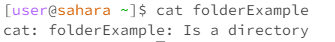
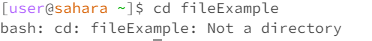
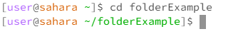
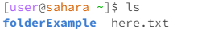
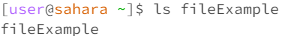
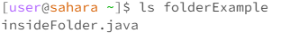

# Cat no Arguments
I got no results from this code. I got that because 'cat' shows what is in a file or a folder. Because it has no reference there is nothing to show. This is not an error.
	
# Cat file Argument
I got nothing when I ran this code. This is because I didn't put anything inside the file I was using. There was nothing there so the code showed nothing. This is an error because it should have said it was a file.
	
# Cat folder Argument
In this code it says 'folderExample: Is a directory'. It is telling me what the folderExample is, a folder or directory. This is not an error.
	
# CD no Arguments
I got no results from this code. I got that because 'cat' shows what is in a file or a folder. Because it has no reference there is nothing to show. This is not an error.
	
# CD file Argument
I got nothing when I ran this code. This is because I didn't put anything inside the file I was using. There was nothing there so the code showed nothing. This is an error because it should have said it was a file.
	
# CD folder Argument
In this code it says 'folderExample: Is a directory'. It is telling me what the folderExample is, a folder or directory. This is not an error.
	
# LS no Arguments
I got no results from this code. I got that because 'cat' shows what is in a file or a folder. Because it has no reference there is nothing to show. This is not an error.
	
# LS file Argument
I got nothing when I ran this code. This is because I didn't put anything inside the file I was using. There was nothing there so the code showed nothing. This is an error because it should have said it was a file.
	
# LS folder Argument
In this code it says 'folderExample: Is a directory'. It is telling me what the folderExample is, a folder or directory. This is not an error.
	

