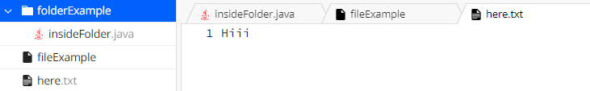
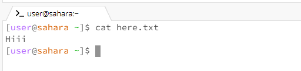

# Week One Lab Report

## Cat no Arguments
I got no results from this code. I got that because `cat` shows what is in a file or a folder. Because it has no reference there is nothing to show. This is not an error. The working directory is `folderExample`.

	
## Cat file Argument
I got "Hiii" when I ran this code. This is because there was text `Hiii` inside the file I was using. This is not an error. The working directory is `folderExample`.

	
## Cat folder Argument
When I coded this command it says `is directory`. This is beacuse `cat` shows you what is in the folder or files you select. This is an error. The working directory is `folderExample`.

	
## CD no Arguments
There was nothing when I used this command. `CD` is the current directory and because there were no arguments it stayed in the current directory. There was no error in this code. The working directory is `folderExample`.

	
## CD file Argument
When I did this it says `Not a directory`. It says that because the CD command is used to focus on a directory not a file. This was an error. The working directory is `folderExample`.

	
## CD folder Argument
When I ran this code it created another line in the terminal. It created this line in order to focus on what is inside the directory that was opened. Now it is my current directory or `cd`. This is the correct action, there was no error. The working directory is `folderExample`.

	
## LS no Arguments
This printed out the result `folderExample` and `here.txt`. This is because both are contained in the current directory I am in. `LS` shows you what is in whatever directory you are in. There was no error. The working directory is `folderExample`.

	
## LS file Argument
ls file example says `file example`. It says that because it is showing what files are in a directory and a file isn't a directory. This is an error. The working directory is `folderExample`.

	
## LS folder Argument
When I did this it said `insideFolder.java`. This was shown because `insideFolder` is inside the directory I typed out with `LS`. `LS` shows what each directory contains. This code doesn't contain an error. The working directory is `folderExample`.

	

